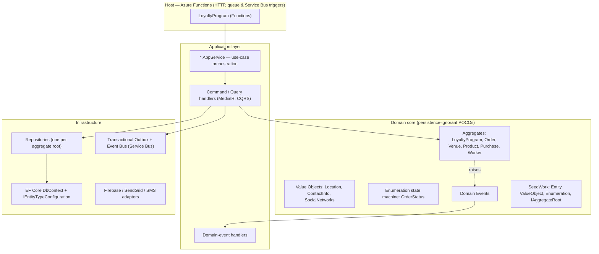

# Domain-Driven Design by Example — a real C#/.NET backend

> A complete, production-grade **Domain-Driven Design** reference built from a real loyalty-program
> backend — not another `Order`/`Customer` toy. Every pattern in the article series below links
> straight to the code that implements it.

[](https://dotnet.microsoft.com/)
[]()
[]()
[](LICENSE)

---

## Why this repo exists

Most DDD tutorials teach the tactical patterns on a domain so simple it never shows you *why* the
patterns exist. You learn what an Aggregate is, but never feel the pain it solves.

This repository is the opposite. It's the backend of a **real loyalty-and-ordering platform** —
venues, loyalty programs, point rules, product catalogues, orders with a real lifecycle, workers,
and multi-tenancy — written in C# on Azure Functions. The startup didn't take off, but the codebase
is a genuinely good DDD reference, so it's been cleaned up, documented, and turned into a teaching
resource.

You get to see DDD applied to a domain with **real invariants and real complexity**:

- A `LoyaltyProgram` aggregate that refuses to be edited once published.
- An `Order` whose status is a **state machine** — you can move it forward, never backward.
- Loyalty **rules** (stamps, percentage, tiered) modelled as versioned strategies.
- **Domain events** raised inside aggregates and dispatched in the same transaction as the save.
- A **transactional outbox** so integration events never get lost to the dual-write problem.
- **Multi-tenancy** baked into the persistence layer.

## The article series

This codebase is the running example for a three-part Medium series. Each part is a standalone,
publishable draft in [`docs/articles`](docs/articles):

| # | Article | What it covers | Anchor code |
|---|---------|----------------|-------------|
| 1 | [**Stop Writing Anemic Domain Models**](docs/articles/01-rich-domain-model.md) | Ubiquitous language, Entities, Value Objects, Aggregates & roots, rich vs. anemic models, factory methods | [`LoyaltyProgram`](src/Loyalty.Core.Entities/Aggregates/LoyaltyPrograms/LoyaltyProgram.cs), [`Location`](src/Loyalty.Core.Entities/Aggregates/Venues/ValueObjects/Location.cs), [`Purchase`](src/Loyalty.Core.Entities/Aggregates/Purchases/Purchase.cs) |
| 2 | [**Your `enum` Is a Code Smell**](docs/articles/02-state-machine-enumeration.md) | The Enumeration-class pattern, modelling an order lifecycle as a state machine, persisting it with EF Core | [`OrderStatusEnumeration`](src/Loyalty.Core.Entities/Aggregates/Orders/Status), [`Order`](src/Loyalty.Core.Entities/Aggregates/Orders/Order.cs) |
| 3 | [**Domain Events & the Dual-Write Bug**](docs/articles/03-domain-events-outbox.md) | Domain events, deferred dispatch (dispatch-before-save), the dual-write problem, the transactional outbox | [`MediatorExtension`](src/Loyalty.Infrastructure.DataAccess/MediatorExtension.cs), [`IntegrationEventLogEntry`](src/Loyalty.Core.Outbox.Entities/IntegrationEventLogEntry.cs) |

A reading guide with the order and prerequisites lives in [`docs/articles/README.md`](docs/articles/README.md).

## Architecture at a glance

The solution follows a **Clean / Onion architecture**: dependencies point *inward*, toward the
domain. The domain core knows nothing about EF Core, Azure, or HTTP.



**Dependency rule:** `Infrastructure → Application → Domain`. Every *reference* arrow points at
`Domain`, which references nothing outward.

### The DDD building blocks, and where to find them

| DDD concept | In this codebase |
|-------------|------------------|
| **SeedWork** (shared base types) | [`SeedWork/`](src/Loyalty.Core.Entities/SeedWork) — [`Entity`](src/Loyalty.Core.Entities/SeedWork/Entity.cs), [`ValueObject`](src/Loyalty.Core.Entities/SeedWork/ValueObject.cs), [`Enumeration`](src/Loyalty.Core.Entities/SeedWork/Enumeration.cs) |
| **Aggregate root** | [`IAggregateRoot`](src/Loyalty.Core.Entities/SeedWork/Interfaces/IAggregateRoot.cs), implemented by [`LoyaltyProgram`](src/Loyalty.Core.Entities/Aggregates/LoyaltyPrograms/LoyaltyProgram.cs), [`Order`](src/Loyalty.Core.Entities/Aggregates/Orders/Order.cs), [`Venue`](src/Loyalty.Core.Entities/Aggregates/Venues/Venue.cs) |
| **Value Object** | [`Location`](src/Loyalty.Core.Entities/Aggregates/Venues/ValueObjects/Location.cs), [`ContactInfo`](src/Loyalty.Core.Entities/Aggregates/Venues/ValueObjects/ContactInfo.cs), [`SocialNetworks`](src/Loyalty.Core.Entities/Aggregates/Venues/ValueObjects/SocialNetworks.cs) |
| **Enumeration / SmartEnum** | [`OrderStatusEnumeration`](src/Loyalty.Core.Entities/Aggregates/Orders/Status/Abstract/OrderStatusEnumeration.cs) + the eight [state classes](src/Loyalty.Core.Entities/Aggregates/Orders/Status) |
| **Domain events** | [`Events/`](src/Loyalty.Core.Entities/Events) — raised via [`Entity.AddDomainEvent`](src/Loyalty.Core.Entities/SeedWork/Entity.cs) |
| **Factory methods** | [`Purchase.Assign` / `Purchase.Burn`](src/Loyalty.Core.Entities/Aggregates/Purchases/Purchase.cs) |
| **Repository (per aggregate)** | [`Interfaces/Repository/`](src/Loyalty.Core.Entities/Interfaces/Repository) |
| **Strategy / rules** | [`Rules/`](src/Loyalty.Core.Entities/Rules) — [`StampsRuleV1`](src/Loyalty.Core.Entities/Rules/StampsRuleV1.cs), [`PercentFixedRuleV1`](src/Loyalty.Core.Entities/Rules/PercentFixedRuleV1.cs) |
| **Persistence ignorance** | EF mapping lives in [`EntityConfigurations/`](src/Loyalty.Infrastructure.DataAccess/EntityConfigurations), not in the entities |
| **Domain-event dispatch** | [`MediatorExtension.DispatchDomainEventsAsync`](src/Loyalty.Infrastructure.DataAccess/MediatorExtension.cs) called from [`LoyaltyDbContext.SaveEntitiesAsync`](src/Loyalty.Infrastructure.DataAccess/Context/LoyaltyDbContext.cs) |
| **Transactional outbox** | [`IntegrationEventLogEntry`](src/Loyalty.Core.Outbox.Entities/IntegrationEventLogEntry.cs) + [`PersistentIntegrationEventService`](src/Loyalty.Infrastructure.Outbox/PersistentIntegrationEventService.cs) |
| **CQRS** | separate command and query handlers under `Loyalty.Domain.Handlers.*` |
| **Multi-tenancy** | [`TenantEntity`](src/Loyalty.Core.Entities/Base/TenantEntity.cs) + [`ITenantProvider`](src/Loyalty.Core.Contracts/ITenantProvider.cs) |

## Tech stack

- **C# / .NET** with **Azure Functions** as the host (HTTP, Queue and Service Bus triggers)
- **Entity Framework Core** (SQL Server) for the write model, **Dapper** for some reads
- **MediatR** for in-process command/query/event dispatch
- **FluentValidation** for request validation
- **Azure Service Bus** for integration events, backed by a **transactional outbox**
- **Firebase**, **SendGrid**, and an SMS gateway as external adapters

## Repository structure

```
src/
  Loyalty.Core.Entities/          # The domain core — aggregates, value objects, events, seedwork
  Loyalty.Core.Contracts/         # Domain-facing abstractions (tenant provider, db context)
  Loyalty.Core.Outbox.Entities/   # Outbox / integration-event model
  Loyalty.Application.*/           # Application services, view models, validators, AutoMapper
  Loyalty.Domain.Handlers.*/      # CQRS command & query handlers, domain-event handlers
  Loyalty.Infrastructure.*/       # EF Core, repositories, outbox, Firebase, IoC, logging
  LoyaltyProgram/                 # Azure Functions host (the composition root + triggers)
common/                           # Cross-service notification/event contracts
test/                             # Integration tests + availability checks
docs/
  ARCHITECTURE.md                 # A guided, layer-by-layer walkthrough
  articles/                       # The three-part DDD article series
```

A deeper, layer-by-layer tour is in [`docs/ARCHITECTURE.md`](docs/ARCHITECTURE.md).

## Running it locally

> This is a teaching reference, not a turnkey deployment — it expects Azure resources to point at.
> The fastest way to *learn* from it is to read the code alongside the articles.

1. Install the [.NET SDK](https://dotnet.microsoft.com/download) and the
   [Azure Functions Core Tools](https://learn.microsoft.com/azure/azure-functions/functions-run-local).
2. Copy the settings template and fill in your own values:
   ```bash
   cp src/LoyaltyProgram/local.settings.example.json src/LoyaltyProgram/local.settings.json
   ```
3. Point `DbSettings:ConnectionString` at a local SQL Server / LocalDB instance and apply migrations
   from `Loyalty.Infrastructure.DataAccess`.
4. Build and run:
   ```bash
   dotnet build src/LoyaltyProgram.sln
   cd src/LoyaltyProgram && func start
   ```

### A note on secrets

The real `local.settings.json` (which once held live keys) has been **scrubbed from the entire git
history**. Only [`local.settings.example.json`](src/LoyaltyProgram/local.settings.example.json) — with
placeholder values — is committed, and the real file is now git-ignored. Never commit credentials.

## License

[MIT](LICENSE) — use it, learn from it, fork it.
