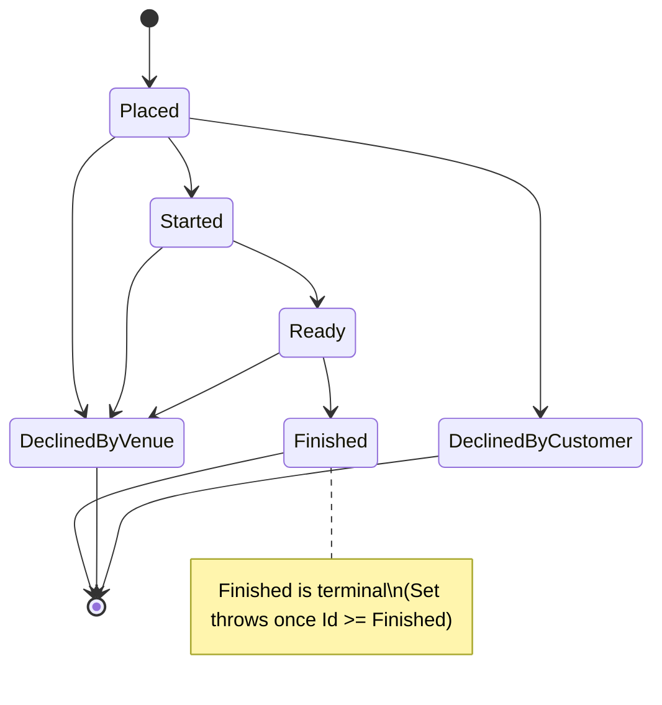

# Your `enum` Is a Code Smell: Modelling a State Machine with the Enumeration Pattern in C#

*Part 2 of 3 — Domain-Driven Design, learned from a real loyalty-program backend.*

---

In [Part 1](01-rich-domain-model.md) we put behaviour back into our aggregates and made invalid states
unrepresentable. Now let's tackle the place where invalid states love to hide: **status fields.**

Here's an order's lifecycle in our loyalty platform. A customer places an order; the venue starts
preparing it; it becomes ready; the customer picks it up and it's finished. Along the way it can be
declined. The naive model:

```csharp
public enum OrderStatus { Placed, Started, Ready, Finished, DeclinedByVenue, /* … */ }

public class Order
{
    public OrderStatus Status { get; set; }
}
```

And then, scattered across the codebase, the logic that *should* govern this lifecycle:

```csharp
if (order.Status == OrderStatus.Finished)
    throw new Exception("Can't change a finished order");

if (newStatus == OrderStatus.Started && order.Status != OrderStatus.Placed)
    throw new Exception("Can only start a placed order");
// …repeated, slightly differently, in five other places
```

The `enum` itself is just a labelled integer. It carries **no behaviour and no rules**. So every rule
about *which transitions are legal* leaks out into `if`/`switch` statements that get copy-pasted, drift
apart, and forget cases. Nothing stops `order.Status = OrderStatus.Finished` from being assigned to a
brand-new order. This is the anemic model from Part 1, in miniature.

Microsoft's DDD guidance calls this out directly and offers the fix:
[**Enumeration classes over enum types**](https://learn.microsoft.com/en-us/dotnet/architecture/microservices/microservice-ddd-cqrs-patterns/enumeration-classes-over-enum-types).
Steve Smith productised it as the [SmartEnum](https://github.com/ardalis/SmartEnum) library. Let's build
a real one — a state machine where illegal transitions are impossible by construction.

## The Enumeration base class

The idea: instead of a labelled integer, a status is an **object** — a class whose instances are static
readonly fields. Because it's a class, it can carry data *and behaviour*. Here's the
[`Enumeration`](../../src/Loyalty.Core.Entities/SeedWork/Enumeration.cs) base from our SeedWork (trimmed):

```csharp
public abstract class Enumeration : IComparable
{
    public string Name { get; private set; }
    public int Id { get; }

    protected Enumeration(int id, string name) { Id = id; Name = name; }

    public static IEnumerable<T> GetAll<T>() where T : Enumeration =>
        typeof(T).GetFields(BindingFlags.Public | BindingFlags.Static | BindingFlags.DeclaredOnly)
                 .Select(f => f.GetValue(null)).Cast<T>();

    public override bool Equals(object obj) =>
        obj is Enumeration other && GetType() == obj.GetType() && Id.Equals(other.Id);

    public override int GetHashCode() => Id.GetHashCode();
    public int CompareTo(object other) => Id.CompareTo(((Enumeration)other).Id);
}
```

It gives every status a stable `Id` and `Name`, value equality, ordering (`IComparable` — we'll use that
in a moment), and `GetAll<T>()` to enumerate every value via reflection. Already more than an `enum`
gives you. But the real win is the next step.

## Turning the enumeration into a state machine

Each order status becomes its **own class** that overrides a single method: `Set(Order)`, which knows
whether *it* is a legal next state and either applies itself or refuses. The abstract base
([`OrderStatusEnumeration`](../../src/Loyalty.Core.Entities/Aggregates/Orders/Status/Abstract/OrderStatusEnumeration.cs)):

```csharp
public abstract class OrderStatusEnumeration : Enumeration
{
    protected OrderStatusEnumeration(OrderStatus id, string name) : base((int)id, name) { }

    public static OrderStatusEnumeration From(int id) =>
        List().SingleOrDefault(s => s.Id == id)
        ?? throw new LoyaltyValidationException(
            $"Possible values for OrderStatus: {string.Join(",", List().Select(s => s.Name))}");

    public static IEnumerable<OrderStatusEnumeration> List() => new[]
    {
        PlacedOrder.Placed, StartedOrder.Started, ReadyOrder.Ready, FinishedOrder.Finished,
        DeclinedByVenueOrder.DeclinedByVenue, DeclinedByCustomerOrder.DeclinedByCustomer,
        ForceDeclinedByCustomerOrder.ForceDeclinedByCustomer, NotRedeemedOrder.NotRedeemed
    };

    // Default: refuse. Each concrete state opts in by overriding.
    public virtual void Set(Order order) =>
        throw new LoyaltyValidationException(
            "Impossible to change order to this state.", ErrorCode.ORDER_INVALID_STATE);
}
```

The default `Set` **throws**. A state is reachable only if its class explicitly overrides `Set` to allow
the transition. Here's [`StartedOrder`](../../src/Loyalty.Core.Entities/Aggregates/Orders/Status/StartedOrder.cs):

```csharp
public class StartedOrder : OrderStatusEnumeration
{
    public static readonly OrderStatusEnumeration Started =
        new StartedOrder(OrderStatus.Started, nameof(OrderStatus.Started).ToLowerInvariant());

    public override void Set(Order order)
    {
        if (order.Status.Id > Started.Id)            // can't go backwards
            throw new LoyaltyValidationException(
                "Impossible to change order to this state.", ErrorCode.ORDER_INVALID_STATE);

        order.UpdateStatus(this);
    }
}
```

The rule "you can move an order forward but never backward" becomes a single comparison —
`order.Status.Id > Started.Id` — made possible because the `Enumeration` base is `IComparable` and the
ids are ordered by the lifecycle. [`ReadyOrder`](../../src/Loyalty.Core.Entities/Aggregates/Orders/Status/ReadyOrder.cs)
and [`FinishedOrder`](../../src/Loyalty.Core.Entities/Aggregates/Orders/Status/FinishedOrder.cs) follow
the same shape with `>` and `>=` guards;
[`DeclinedByVenueOrder`](../../src/Loyalty.Core.Entities/Aggregates/Orders/Status/DeclinedByVenueOrder.cs)
allows declining at any point *before* the order is finished. And the terminal/customer-driven states —
[`DeclinedByCustomerOrder`](../../src/Loyalty.Core.Entities/Aggregates/Orders/Status/DeclinedByCustomerOrder.cs),
[`PlacedOrder`](../../src/Loyalty.Core.Entities/Aggregates/Orders/Status/PlacedOrder.cs) — *don't*
override `Set` at all, so the base class's "refuse" is the behaviour. The set of legal transitions is
described entirely by which classes override `Set` and what guard they use.



## The aggregate drives the transition

The `Order` aggregate root never lets a caller assign a status directly. It exposes intention —
`UpdateStatus` — and delegates the *decision* to the state object
([`Order`](../../src/Loyalty.Core.Entities/Aggregates/Orders/Order.cs)):

```csharp
public OrderStatusEnumeration Status { get; private set; }

public void UpdateStatus(OrderStatus status, string comment)
{
    var newStatus = OrderStatusEnumeration.From((int)status);
    VenueComment = comment;
    newStatus.Set(this);                 // the target state decides if it's reachable

    if (string.IsNullOrEmpty(comment) && status == OrderStatus.DeclinedByVenue)
        throw new LoyaltyValidationException(
            "Comment required if declined by Venue", ErrorCode.ORDER_INVALID_STATE);

    AddDomainEvent(new OrderStatusChangedDomainEvent(this));
}

internal void UpdateStatus(OrderStatusEnumeration newStatus) => Status = newStatus;
```

The flow is: convert the incoming value to its state object, ask *that object* to `Set` itself on the
order, and if it agrees, the `internal` overload actually flips the field. A status change also raises an
`OrderStatusChangedDomainEvent` — the hook we'll use in [Part 3](03-domain-events-outbox.md) to notify
the customer. Compare this to the `if`-soup we started with: there's now exactly **one** place a
transition can happen, and the legality of each transition lives next to the state it concerns.

## Persisting it cleanly with EF Core

A fair objection: "Great, but my database column is an `int`. Doesn't an object-as-status break
persistence?" No — and this is where the design stays honest about the dependency rule from Part 1. The
domain stays persistence-ignorant; the mapping lives in infrastructure. EF Core's **value converter**
bridges the two
([`OrderConfiguration`](../../src/Loyalty.Infrastructure.DataAccess/EntityConfigurations/OrderConfiguration.cs)):

```csharp
builder
    .Property(e => e.Status)
    .HasConversion(
        v => v.Id,                          // object  → int, going to the DB
        v => OrderStatusEnumeration.From(v)); // int → object, coming back
```

The column is still a plain `int`. On the way out, the status object becomes its `Id`; on the way back,
`OrderStatusEnumeration.From(int)` rehydrates the right state class. Your schema doesn't change, your
queries don't change, and the domain never learns that EF Core exists.

## A word on real code: it has warts

This is a real codebase, so here's an honest teaching moment. Look closely at `ReadyOrder`:

```csharp
public static readonly OrderStatusEnumeration Ready =
    new ReadyOrder(OrderStatus.Ready, nameof(OrderStatus.Placed).ToLowerInvariant());
//                                            ^^^^^^^^^^^^^^^^^^^ copy-paste bug: should be Ready
```

The `Id` is correct (`OrderStatus.Ready`), but the *display name* was copy-pasted as `"placed"`. The
transition logic — which keys off `Id` — works fine, which is exactly why a bug like this survives: it
only bites when something renders the name. The lesson isn't "enumeration classes are dangerous"; it's
that the static-field-per-state style invites copy-paste, so **a tiny test that asserts
`status.Name == "ready"` for every state** pays for itself. (`Enumeration.GetAll<T>()` makes that a
one-line, data-driven test.) Patterns reduce a *class* of bugs; they don't replace tests.

## The trade-offs

The Enumeration pattern isn't free, so use it where it earns its keep:

- **Use it** when a value has *behaviour*, *rules about transitions*, or needs to carry extra data — a
  status with a lifecycle, a card type with a fee, a plan with limits. The order lifecycle is a textbook
  fit.
- **Don't bother** for a dumb label with no behaviour and no transition rules (a `Color`, a two-value
  flag). A plain `enum` is simpler and a value converter is unnecessary ceremony.
- **Watch the reflection cost.** `GetAll<T>()` uses reflection; for hot paths, cache the result (our
  `List()` returns a fresh array each call — fine here, but cache if you call it in a tight loop).
- **Consider the [SmartEnum](https://github.com/ardalis/SmartEnum) library** instead of hand-rolling the
  base class — it gives you the equality, `FromValue`/`FromName`, and EF Core converters out of the box.
  Hand-rolling is great for *learning* the pattern (as here); reach for the library in production.

## Takeaways

- **A bare `enum` is an anemic value** — a labelled int with no behaviour, so its rules leak into
  scattered `if`/`switch` statements.
- **Model a lifecycle as a state machine**: one class per state, a polymorphic `Set`/transition method,
  and a default that *refuses*. Legal transitions become the only ones that exist.
- **Order the ids by the lifecycle** and you can express "no going backward" as one comparison.
- **Let the aggregate own the transition** and raise a domain event; never expose a public status setter.
- **Persist with an EF Core value converter** so the domain stays persistence-ignorant and the column
  stays an `int`.
- **Still write the small test.** Patterns kill bug *classes*, not copy-paste typos.

In **Part 3**, we follow that `OrderStatusChangedDomainEvent` out of the aggregate: how domain events
decouple side effects, why dispatching them *before* the save matters, and how the **transactional
outbox** stops the dual-write bug from silently losing your "your order is ready!" notification.
[Read Part 3 →](03-domain-events-outbox.md)

---

*Full source: [ddd-by-example](https://github.com/richardchanjr90-cpu/ddd-by-example). The eight order
states live in [`Aggregates/Orders/Status`](../../src/Loyalty.Core.Entities/Aggregates/Orders/Status).*
