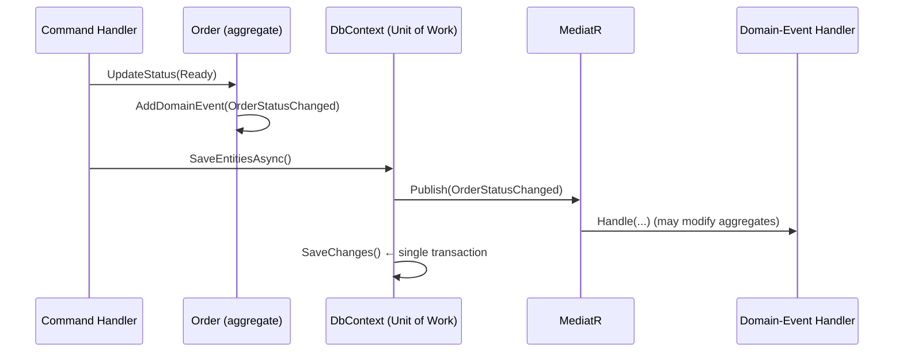
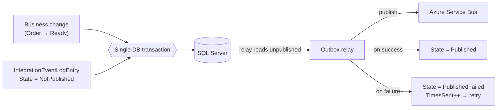

# Domain Events & the Dual-Write Bug You Don't Know You Have

*Part 3 of 3 — Domain-Driven Design, learned from a real loyalty-program backend.*

---

In [Part 2](02-state-machine-enumeration.md), changing an order's status ended with one quiet line:

```csharp
AddDomainEvent(new OrderStatusChangedDomainEvent(this));
```

When an order becomes *Ready*, several things should happen: the customer gets a push notification, the
venue's dashboard updates, analytics records a fulfilment time. The naive approach is to cram all of that
into the command handler:

```csharp
order.UpdateStatus(OrderStatus.Ready, comment);
await repository.SaveAsync(order);
await pushService.NotifyCustomerAsync(order);     // and now the handler knows about push,
await analytics.RecordAsync(order);               // and analytics, and email, and …
await dashboard.RefreshAsync(order.VenueId);      // forever growing
```

Every new side effect makes the handler heavier, couples your core use case to infrastructure it
shouldn't care about, and — the part nobody notices until 2 a.m. — introduces a **data-consistency bug**.
This final part is about both problems: **domain events** decouple the side effects, and the
**transactional outbox** makes sure they actually happen. Both are demonstrated in the
[ddd-by-example](https://github.com/richardchanjr90-cpu/ddd-by-example) codebase.

## Domain events: "something happened" as a first-class object

A **Domain Event** is an immutable record, named in the **past tense**, of something meaningful that
occurred in the domain — `OrderStatusChangedDomainEvent`, `PurchaseMadeEvent`,
`LoyaltyProgramPublishedDomainEvent`. Instead of an aggregate *calling* the things that must react, it
*announces* what happened and stays ignorant of who's listening.

In our model, the aggregate doesn't dispatch anything. It just records events on itself. That capability
lives in the base [`Entity`](../../src/Loyalty.Core.Entities/SeedWork/Entity.cs):

```csharp
public abstract class Entity
{
    private List<INotification> domainEvents;
    public IReadOnlyCollection<INotification> DomainEvents => domainEvents?.AsReadOnly();

    public void AddDomainEvent(INotification eventItem)
    {
        domainEvents ??= new List<INotification>();
        domainEvents.Add(eventItem);
    }

    public void ClearDomainEvents() => domainEvents?.Clear();
}
```

So when `Purchase.Burn(...)` runs, or an order's status changes, the event is *attached to the entity* —
a little outbox living on the object — waiting to be dispatched. The aggregate's job ends at "I declare
that this happened." (We use MediatR's `INotification` as the marker; more on that choice in the
trade-offs.)

## Dispatch *before* save: the deferred-dispatch pattern

Here's the design decision that separates a toy from a real implementation: **when** do those events
fire?

Firing them immediately inside the aggregate method is wrong — the change isn't committed yet, and a
handler might run against state that's about to roll back. The pattern our codebase uses (the same one
Jimmy Bogard described in
"[A better domain events pattern](https://lostechies.com/jimmybogard/2014/05/13/a-better-domain-events-pattern/)"
and Microsoft's reference apps adopted) is to **collect events off all tracked entities and dispatch them
as part of the unit of work**, right before `SaveChanges`.

The unit of work is the `DbContext`. Its
[`SaveEntitiesAsync`](../../src/Loyalty.Infrastructure.DataAccess/Context/LoyaltyDbContext.cs) is the
single choke point:

```csharp
public async Task<bool> SaveEntitiesAsync(CancellationToken cancellationToken = default)
{
    await mediator.DispatchDomainEventsAsync(this);   // 1. dispatch domain events
    await SaveChangesAsync(cancellationToken);         // 2. then persist everything
    return true;
}
```

And the [`DispatchDomainEventsAsync`](../../src/Loyalty.Infrastructure.DataAccess/MediatorExtension.cs)
extension drains every event off every tracked entity and publishes it through MediatR:

```csharp
public static async Task DispatchDomainEventsAsync(this IMediator mediator, LoyaltyDbContext ctx)
{
    var entitiesWithEvents = ctx.ChangeTracker.Entries<Entity>()
        .Where(x => x.Entity.DomainEvents != null && x.Entity.DomainEvents.Any())
        .ToArray();

    var domainEvents = entitiesWithEvents.SelectMany(x => x.Entity.DomainEvents).ToList();

    entitiesWithEvents.ToList().ForEach(e => e.Entity.ClearDomainEvents());

    foreach (var domainEvent in domainEvents)
        await mediator.Publish(domainEvent);
}
```

Why dispatch *before* the save rather than after? Because the domain-event handlers often need to make
*their own* changes to the same aggregates (e.g., a `PurchaseMadeEvent` handler updating a running point
balance), and we want all of those changes to land in the **same `SaveChanges`** — one transaction, one
atomic commit. The command handler from Part 1 stays blissfully thin: it calls `order.UpdateStatus(...)`
and `SaveEntitiesAsync()`, and never mentions push notifications. The
[handler that reacts](../../src/Loyalty.Application.DomainEvents.Handlers) to the event lives off to the
side, registered by MediatR.



## Domain events vs integration events — don't blur them

Domain events are **in-process**: they coordinate side effects *inside one bounded context*, in the same
transaction. But notifying the customer's phone, or telling a *different* service, crosses a process
boundary. That's a different animal — an **integration event** — and it must not pretend to be a
synchronous in-memory call.

The codebase keeps the two separate. The integration-event model lives in its own project, starting with
[`IntegrationEvent`](../../src/Loyalty.Core.Outbox.Entities/IntegrationEvent.cs):

```csharp
public class IntegrationEvent : INotification
{
    public IntegrationEvent() { Id = Guid.NewGuid(); CreationDate = DateTime.UtcNow; }
    public Guid Id { get; set; }
    public DateTime CreationDate { get; set; }
}
```

The boundary looks like this: a *domain-event handler* (in-process) decides "this is worth telling the
outside world," and turns it into an *integration event* that goes onto a message bus (Azure Service Bus,
here). Which raises the question that breaks most naive implementations: how do you publish to the bus
*and* commit your database change without one of them silently failing?

## The dual-write bug

Picture the obvious code:

```csharp
await dbContext.SaveChangesAsync();          // 1. commit the order to SQL
await serviceBus.PublishAsync(integrationEvent);  // 2. publish "OrderReady" to the bus
```

Two separate systems, two separate operations, **no shared transaction**. Now imagine the process crashes
— or the Service Bus is briefly unreachable — *between* line 1 and line 2. The order is committed in the
database, but the "OrderReady" event is **gone forever**. The customer never gets notified. There's no
exception in your logs that says "data is now inconsistent"; everything looks fine. Flip the order of the
two lines and you get the opposite ghost: an event announcing an order that was never saved.

This is the **dual-write problem**, and it's not a style preference — it's a latent data-corruption bug.
You cannot fix it by adding retries or a `try/catch`, because the failure can happen *after* the database
commits and *before* the publish, where neither side can compensate reliably. (Chris Richardson's
[write-up](https://microservices.io/patterns/data/transactional-outbox.html) is the canonical
description.)

## The transactional outbox

The fix is to stop doing two writes to two systems. Instead, do **one** write — to the database — that
includes *both* the business change *and* a record of the event, in the **same transaction**. Then a
separate process reads those records and publishes them. If both commit, great. If the transaction rolls
back, *neither* the order nor the event exists. They can never disagree.

The event record is an
[`IntegrationEventLogEntry`](../../src/Loyalty.Core.Outbox.Entities/IntegrationEventLogEntry.cs) — the
event serialized to JSON, with a state and the id of the transaction that produced it:

```csharp
public class IntegrationEventLogEntry
{
    public IntegrationEventLogEntry(INotification integrationEvent, Guid transactionId)
    {
        EventId = Guid.NewGuid();
        CreationTime = DateTime.UtcNow;
        EventTypeName = integrationEvent.GetType().FullName;
        Content = JsonSerializer.Serialize(integrationEvent, integrationEvent.GetType());
        State = EventStateEnum.NotPublished;   // ← starts life unpublished
        TransactionId = transactionId.ToString();
    }
    public EventStateEnum State { get; set; }
    public int TimesSent { get; set; }
    public string Content { get; private set; }
    // …
}
```

The crucial move is in
[`PersistentIntegrationEventService`](../../src/Loyalty.Infrastructure.Outbox/PersistentIntegrationEventService.cs):
the outbox writer **enlists in the same database transaction** as the business change, by reusing the
business `DbContext`'s connection and current transaction:

```csharp
public PersistentIntegrationEventService(ILoyaltyTenantDbContext tenantDbContext)
{
    this.dbContext = new IntegrationEventsContext(
        new DbContextOptionsBuilder<IntegrationEventsContext>()
            .UseSqlServer(tenantDbContext.Database.GetDbConnection())   // same connection
            .Options);

    var transaction = tenantDbContext.GetCurrentTransaction();
    if (transaction != null)
    {
        dbContext.Database.UseTransaction(transaction.GetDbTransaction());  // same transaction
        transactionId = transaction.TransactionId;
    }
}

public async Task SaveEventAsync(INotification integrationEvent)
{
    var entry = new IntegrationEventLogEntry(integrationEvent, transactionId);
    await dbContext.IntegrationEvents.AddAsync(entry);
    await dbContext.SaveChangesAsync(default);   // commits with the business change, atomically
}
```

Because the outbox row shares the order's transaction, the order and its "OrderReady" event are now
**atomic**: both land, or neither does. The dual-write window is closed.

A separate relay then does the second half asynchronously: read the unpublished rows, push each to the
bus, and mark the outcome. The state transitions are modelled explicitly —
`NotPublished → Published`, or `PublishedFailed` on error, with a `TimesSent` counter for retries:

```csharp
public Task MarkEventAsPublishedAsync(Guid eventId) =>
    UpdateEventStatus(eventId, EventStateEnum.Published);

public Task MarkEventAsFailedAsync(Guid eventId) =>
    UpdateEventStatus(eventId, EventStateEnum.PublishedFailed);
```



The guarantee this buys you is **at-least-once delivery**: an event might be sent twice (the relay
publishes, then crashes before marking it `Published`, then retries), so downstream consumers should be
**idempotent**. That's the deliberate trade of the outbox — it converts "silently lost" into "possibly
duplicated," and duplicates are something you *can* defend against.

## The trade-offs

- **MediatR is a choice, not a commandment.** This codebase routes both domain events and commands
  through MediatR, which is convenient but draws fair criticism: wrapping everything in `INotification`/
  `IRequest` adds indirection and can hurt traceability. You can implement domain events with a plain
  interface and a hand-written dispatcher. Use MediatR where the decoupling is worth the indirection, not
  reflexively.
- **Don't over-event.** Not every method needs a domain event. Events are for *meaningful* domain
  occurrences that something else genuinely reacts to. Firing them for trivial setters just adds noise and
  makes the real ones harder to find. And keep business logic *in the aggregate*, not in the handler — the
  handler reacts, it doesn't own the rules.
- **The outbox needs a relay and cleanup.** You're now running a background publisher and accumulating a
  log table that needs pruning. That operational cost is only worth paying when losing an event actually
  matters. For a fire-and-forget metric, a best-effort publish is fine; for "charge the customer" or
  "your order is ready," the outbox earns its keep.
- **You traded lost-messages for duplicates.** Make consumers idempotent. There's no free lunch in
  distributed systems — only better-chosen failure modes.

## Takeaways

- **Domain events decouple side effects.** Aggregates *announce* what happened; they don't call the
  things that react. Your command handlers stay thin.
- **Dispatch events as part of the unit of work, before `SaveChanges`**, so handler changes commit in the
  same transaction.
- **Domain events ≠ integration events.** In-process coordination vs. crossing a boundary — keep the line
  sharp.
- **Dual-write is a bug, not a style.** Saving to a DB and publishing to a bus as two operations will
  silently lose messages.
- **The transactional outbox fixes it** by writing the event in the same transaction as the business
  change and relaying it asynchronously — at-least-once delivery, so make consumers idempotent.

That's the series: from putting behaviour back into your model ([Part 1](01-rich-domain-model.md)), to
modelling a lifecycle as a state machine ([Part 2](02-state-machine-enumeration.md)), to letting
aggregates communicate safely (here). The patterns aren't academic — every one of them solves a problem
that bit a real product. The full, runnable source is in the
[ddd-by-example](https://github.com/richardchanjr90-cpu/ddd-by-example) repository.

---

*If this series was useful, the repo's [README](https://github.com/richardchanjr90-cpu/ddd-by-example)
maps every DDD pattern to the exact file that implements it — a good companion while you apply these to
your own codebase.*
